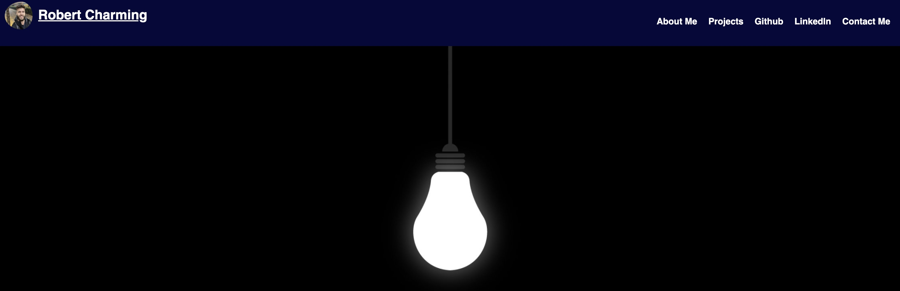

# Portfolio Mini Project 

## Description

This challenge was about building the foundations for an online portfolio. My hope for this project is to continually update it with new projects and applications. After refining it over the course of this program, I hope to be able to use this portfolio as a discussion point in future interviews. 

## Installation

Go to https://github.com/BobbyCharms/portfolio-mini-project to view or download the repo and its contents. 

For the live website, visit this link: https://bobbycharms.github.io/portfolio-mini-project/

You should see: 

## License

N/A

## How to Contribute

This project welcomes feedback and suggestions! Please feel free to download the code, make your proposed changes, and submit a pull request or reach out to me directly with recommendations!

## Tests

N/A